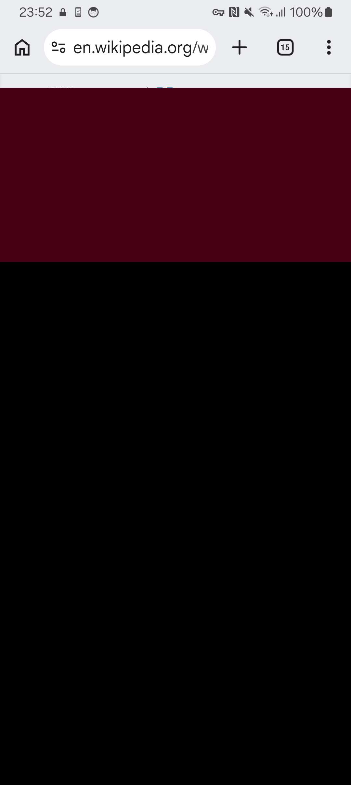
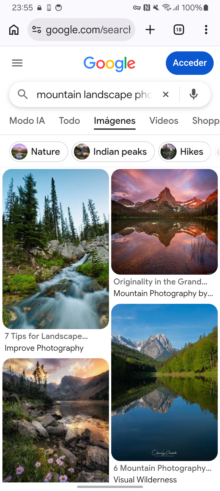
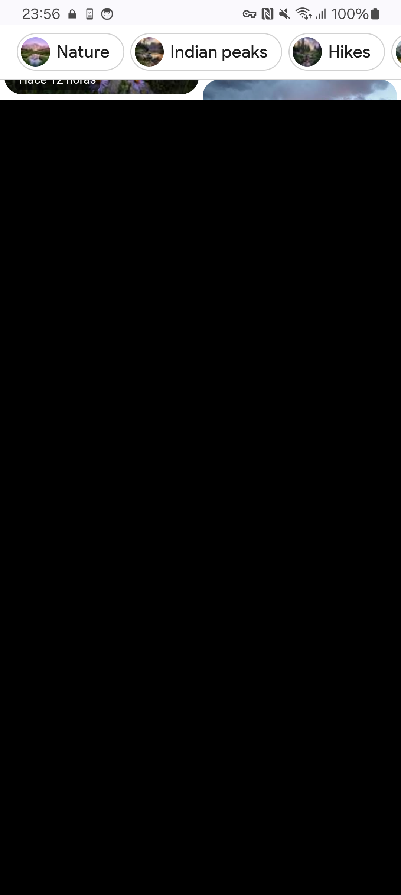
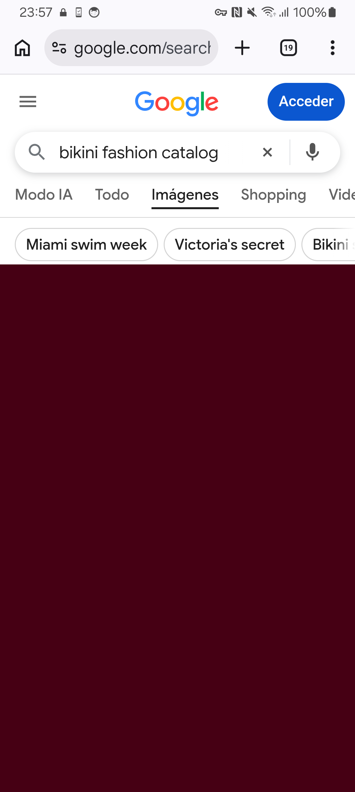
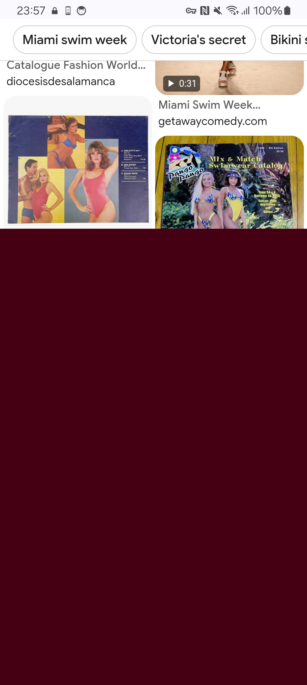
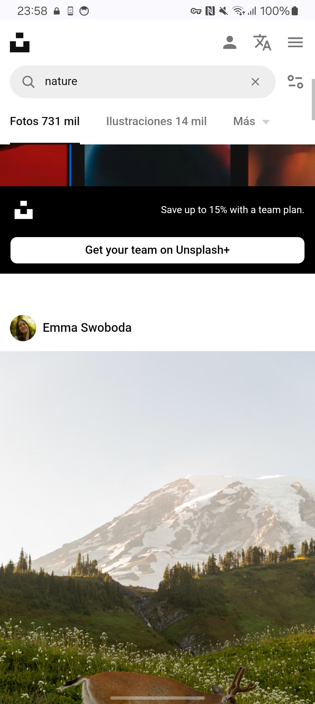
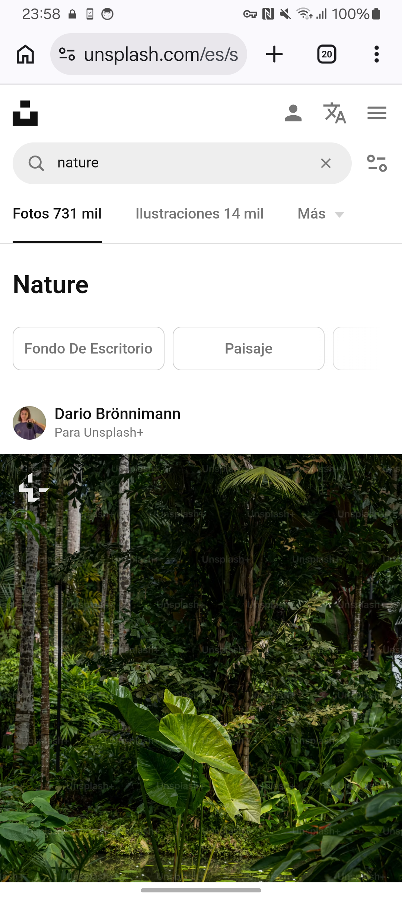

# CHROME-GLOSHIA-A23 — evidencia fisica

Fecha: 2026-08-20/21. Resultado: **FAILED**.

## Identidad exacta

- Rama: `review/chrome-visual-closure-batch-04`.
- Worktree probado: `/private/tmp/glosh-chrome-visual-closure.7v8qi8`.
- HEAD durante la prueba: `2ce17b312ae0ef2278c74c78e5a2f61aae41e62f`.
- Base/codigo de producto: `88ca10f605ea297c0e303bc35e04ab45937ec636`.
- APK DEV reutilizado, sin recompilar: `versionCode=311`, SHA-256
  `e412dea28859f52743151bffd8a66256bdb23e7dece4eee73437169b9ca1c536`.
- A23: `SM-A235M`, Android 14 / API 34, ARM64.
- Chrome: `151.0.7922.137`.
- GloshIA Visual R3.1 real; probe apagado. El hash del modelo empaquetado esta en
  [`model-sha256.txt`](evidence/chrome-gloshia-a23/model-sha256.txt).

## Procedimiento ejecutado

1. Se confirmo el A23 exacto por USB y se reinstalo el APK existente con `adb
   install -r`, sin borrar datos.
2. Se habilito temporalmente Accessibility y se confirmo el servicio enlazado.
3. Wikipedia `Cat`: espera inicial, captura, tres scrolls abajo, dos arriba.
4. Google Images `mountain landscape photography`: espera inicial, dos scrolls
   abajo, uno arriba.
5. Google Images `bikini fashion catalog`: espera inicial y un scroll abajo.
6. Unsplash `nature`: espera inicial, dos scrolls abajo y uno arriba.
7. Se recolectaron grabaciones, capturas nativas, Logcat dirigido, meminfo y
   cpuinfo. Se controlo crash/ANR.
8. Accessibility se restauro exactamente a `null` / `0` y se retiraron del
   telefono los videos temporales creados por la prueba.

No se repitio la prueba para esta publicacion.

## Resultado observado

### Estaticas

Wikipedia quedo bajo mosaicos negros/bordo sin decision terminal antes de los
scrolls. La cobertura existio, pero no fue usable.

Log: [`static-logcat.txt`](evidence/chrome-gloshia-a23/static-logcat.txt).

### Google Images permitido

GloshIA libero paisajes (`allowed=9 blocked=0` y luego ocho mosaicos permitidos),
pero la decision completa inicial tardo `4.249 s`.

Despues del scroll el viewport quedo casi completamente negro durante varios
segundos; el regreso repitio la cobertura perceptible.

### Google Images contrastante

La primera decision util registro `allowed=3 blocked=6` en `4.080 s` y dejo la
cobertura bordo.

Tras el scroll quedaron imagenes visibles arriba mientras una cobertura bordo
amplia comenzaba desde media pantalla. La cobertura no acompanaba de forma
atomica la geometria nueva.

Log completo del motor:
[`google-query-engine-logcat.txt`](evidence/chrome-gloshia-a23/google-query-engine-logcat.txt).

### Pagina dinamica y lazy-load

Unsplash seguro recupero visibilidad, pero el lote inicial tardo `7.019 s`.

Los scrolls funcionaron y presentaron contenido nuevo, pero el verificador dejo
de emitir antes de ellos; por eso no se demuestra cobertura continua del lazy-load.

Log: [`dynamic-engine-logcat.txt`](evidence/chrome-gloshia-a23/dynamic-engine-logcat.txt).

## Metricas y estabilidad

- Capturas de ventana observadas en los bloques concluyentes: `66–157 ms`.
- Decisiones iniciales concluyentes: `4.080–7.019 s`.
- Memoria final: PSS `180.791 KB`, RSS `180.748 KB`.
- Sin crash ni ANR en Logcat/Dropbox recolectado.
- [`final-meminfo.txt`](evidence/chrome-gloshia-a23/final-meminfo.txt)
- [`final-cpuinfo.txt`](evidence/chrome-gloshia-a23/final-cpuinfo.txt)
- Restauracion:
  [`restored-accessibility-services.txt`](evidence/chrome-gloshia-a23/restored-accessibility-services.txt),
  [`restored-accessibility-enabled.txt`](evidence/chrome-gloshia-a23/restored-accessibility-enabled.txt).

## Causa observada

Chrome Visual trabaja sobre capturas y mosaicos, no intercepta cada imagen como
DAG. Para scroll con identidad y viewport estables, la politica no exige baseline
y el controlador no ejecuta precobertura. Los overlays existentes permanecen en
coordenadas de pantalla mientras la pagina se desplaza; la cobertura nueva llega
despues de settle, captura, deteccion y evaluacion secuencial. La secuencia
explica la exposicion/desalineacion y las esperas negras registradas.

## Cambios y cierre

- Cambios de codigo durante la prueba: ninguno.
- Diff/commit de producto: ninguno.
- APK/version/modelo: sin cambios.
- No hubo merge, Production, deploy ni PR nuevo.

Siguiente paso minimo, no ejecutado: ticket de Proteccion Android para cobertura
atomica de scroll/cambio visual con replay anti-flash antes de otra APK o sesion
fisica. Video y DRM permanecen fuera de alcance.
